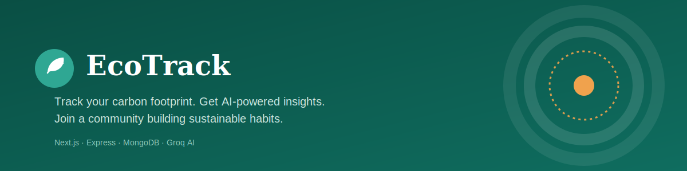

# 🌿 EcoTrack



**Track your carbon footprint. Get AI-powered insights. Join a community building sustainable habits.**

EcoTrack is a full-stack agentic AI application where users log daily habits (commute, energy use, diet, waste), see their carbon footprint calculated and visualized, and get AI-driven analysis and personalized recommendations — plus a community space to publish and join sustainability challenges.

---

## 🔗 Links

| | |
|---|---|
| 🌍 **Live App** | [ecotrack-client.vercel.app](https://ecotrack-client.vercel.app) |
| ⚙️ **Backend API** | [ecotrack-server-shbb.onrender.com](https://ecotrack-server-shbb.onrender.com/api/health) |
| 💻 **Frontend Repo** | [github.com/tanzid-48/ecotrack-client](https://github.com/tanzid-48/ecotrack-client) *(this repo)* |
| 🖥️ **Backend Repo** | [github.com/tanzid-48/ecotrack-server](https://github.com/tanzid-48/ecotrack-server) |

> ⚠️ The backend is hosted on Render's free tier, which spins down after inactivity. The **first** request after idle time may take 30–50 seconds to respond while it wakes up.

---

## ✨ Features

### Core Platform
- 🏠 **Landing page** — hero, live footprint estimator, how-it-works, categories, comparison chart, featured challenges, community stats, testimonials, FAQ
- 🔍 **Explore challenges** — search, filter (category + difficulty), sort, pagination
- 📄 **Challenge details** — reviews, ratings, related challenges, one-click join
- 🔐 **Auth** — email/password + Google OAuth, demo login, protected routes
- 📊 **Dashboard** — log daily activity, view footprint trend chart, manage logs
- ➕ **Add / manage challenges** — publish and delete your own community challenges
- 🌗 **Dark / light mode**, fully responsive, mobile-friendly navigation

### 🤖 AI Features (powered by Groq)
| Feature | What it does |
|---|---|
| **AI Data Analyzer** | Reads your logged activity history and returns a trend analysis, biggest contributor, and actionable insights — with a downloadable PDF report |
| **AI Recommendation Engine** | Suggests personalized sustainability tips and matches you with relevant community challenges based on your actual data |
| **AI Content Generator** | Auto-writes challenge descriptions from a title and a few key points when publishing a new challenge |

---

## 🧭 How to Use

1. **Create an account** — register with email/password, Google, or click **"Use demo credentials"** on the login page (`demo@ecotrack.app` / `demo1234`)
2. **Log your day** — go to your **Dashboard** and enter today's commute, electricity use, diet, and waste. Your carbon footprint is calculated automatically and plotted on your trend chart
3. **Get AI insight** — click **Analyze my footprint** for a trend breakdown + downloadable PDF report, or **Get recommendations** for personalized tips and matched community challenges
4. **Explore challenges** — browse `/challenges`, filter by category/difficulty, and open any challenge to read details, leave a review, or join it
5. **Publish your own challenge** — from **Add Challenge**, write a title and let the **AI Content Generator** draft the description for you, then publish
6. **Track your profile** — your avatar menu (top right) has **Profile** (your stats + joined/published challenges) and **Dashboard**
7. **Manage what you've made** — **Manage Challenges** lets you view or delete challenges you've published

---

## 🛠️ Tech Stack

**Frontend**
- Next.js 15 (App Router) + TypeScript (strict)
- Tailwind CSS
- TanStack Query
- Recharts (data visualization)
- BetterAuth (client)
- jsPDF (report export)
- Sonner (toast notifications)

**Backend** — see the [server repo](https://github.com/tanzid-48/ecotrack-server)
- Express + TypeScript
- MongoDB (native driver)
- BetterAuth (email/password + Google OAuth, bearer tokens)
- Groq AI (llama-3.3-70b-versatile)

---

## 📁 Project Structure

```
ecotrack-client/
├── src/
│   ├── app/                        # Next.js App Router pages
│   │   ├── page.tsx                 # Landing page
│   │   ├── layout.tsx                # Root layout (theme, navbar, footer)
│   │   ├── globals.css               # Design tokens (colors, fonts)
│   │   ├── login/                    # Login (demo + Google)
│   │   ├── register/                 # Register (+ Google)
│   │   ├── dashboard/                # Activity log, chart, AI features (protected)
│   │   ├── challenges/
│   │   │   ├── page.tsx               # Explore (search/filter/sort/pagination)
│   │   │   ├── [id]/page.tsx          # Challenge details
│   │   │   ├── add/page.tsx           # Add challenge + AI generator (protected)
│   │   │   └── manage/page.tsx        # Manage own challenges (protected)
│   │   ├── about/, contact/          # Additional pages
│   │
│   ├── components/
│   │   ├── layout/                  # Navbar, Footer
│   │   ├── sections/                # Landing page sections (Hero, FAQ, etc.)
│   │   ├── challenges/               # ChallengeCard
│   │   └── auth/                     # ProtectedRoute wrapper
│   │
│   ├── lib/
│   │   ├── api/                     # Typed API calls (challenges, activities, ai, client)
│   │   └── auth-client.ts            # BetterAuth client + bearer token handling
│   │
│   └── types/                       # Shared TypeScript interfaces
│
├── public/
└── package.json
```

---

## 🚀 Running Locally

```bash
npm install
```

Create `.env.local`:
```env
NEXT_PUBLIC_API_URL=http://localhost:5000
```

```bash
npm run dev
```

Make sure the [backend](https://github.com/tanzid-48/ecotrack-server) is running first — see its README for setup (seeding sample data, environment variables, etc.).

**Demo login:** `demo@ecotrack.app` / `demo1234` *(register once with these credentials if testing against your own local database)*

---

## 👤 Author

**Tanzid** — CSE Undergraduate, Pundra University of Science and Technology
[GitHub](https://github.com/tanzid-48) · [LinkedIn](https://linkedin.com/in/tanzidmondol)

---

*Built as a full-stack agentic AI project — combining practical carbon-footprint tracking with real AI reasoning over user data.*
